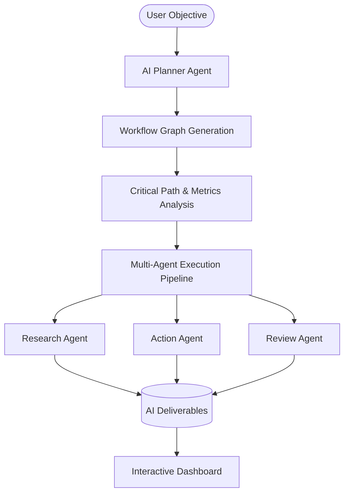

<div align="center">
  
# GoalForge AI

**Autonomous AI Chief of Staff**

*Stop managing tasks. Start managing outcomes.*

[](https://nextjs.org/)
[](https://reactjs.org/)
[](https://www.typescriptlang.org/)
[](https://www.prisma.io/)
[](https://ai.google.dev/)
[](https://reactflow.dev/)
[](https://tailwindcss.com/)
[](https://vibe2ship.com/)


</div>

---

## 🚀 About GoalForge AI

### The Problem
Existing productivity tools only remind users. They give you a blank slate and wait for you to figure out what needs to be done. When deadlines loom, to-do lists become overwhelming, critical bottlenecks are missed, and goals are abandoned.

### The Solution
**GoalForge AI** is an autonomous AI Chief of Staff that actively plans, prioritizes, schedules, executes, and adapts until your goal is complete.

Instead of managing tasks, you manage outcomes. You provide the objective (e.g., *"Launch an AI startup and raise seed funding"*), and GoalForge AI dynamically generates a complete critical path DAG (Directed Acyclic Graph). It leverages specialized multi-agent pipelines to autonomously research, execute, review, and validate deliverables for each node, ensuring you hit your deadlines.

### Key Innovations
- **AI Planning:** Converts abstract goals into structured dependency graphs.
- **Multi-Agent Execution:** Dedicated agents (Research, Planner, Execute, Review) handle specific task types.
- **Critical Path Analysis:** Mathematically determines which tasks will delay your entire project.
- **Deadline Risk Prediction:** Calculates success probability, buffer days, and risk profiling.
- **Intelligent Offline Planner:** Never lose productivity. If the API fails, our local heuristic engine seamlessly builds realistic offline DAGs.
- **AI Deliverables:** Autonomously generates the actual work (documents, plans, code) and attaches it to tasks.
- **Explainable AI:** Complete transparency into how the AI arrived at its decisions.

---

## ✨ Features

| Feature | Description |
|---------|-------------|
| **AI Planner** | Instantly generates comprehensive workflows from a single objective prompt. |
| **Multi-Agent Pipeline** | Distinct AI personas handle specialized steps (Research, Execute, Review). |
| **Critical Path Engine** | Highlights topological bottlenecks to focus your attention on what matters. |
| **Offline Intelligence** | A sophisticated local planner seamlessly takes over if API rate limits are hit. |
| **Dynamic Analytics** | Real-time calculation of success probability and buffer days. |
| **One-Click Export** | Export the entire workflow into a beautifully formatted professional PDF. |

---

## 🏗 Architecture



### Tech Stack
| Category | Technology |
|----------|------------|
| **Frontend** | Next.js 16 (App Router), React 18, Framer Motion |
| **Styling** | Tailwind CSS, Lucide Icons |
| **Backend** | Next.js API Routes, Node.js |
| **Database** | SQLite (Development), Prisma ORM |
| **AI Engine** | Google Gemini (2.5 Flash Lite) |
| **Visualization** | React Flow (DAG Rendering) |

---

## 📸 Screenshots


*The GoalForge AI Interactive Dashboard.*


*Auto-generated topological dependency graph with critical path highlighting.*


*Detailed AI execution deliverables and status.*

---

## 🎮 Demo

- **Live Demo:** [Placeholder Link]
- **Video Demo:** [Placeholder Link]
- **Pitch Deck:** [Placeholder Link]


---

## 💻 Installation

### 1. Clone the repository
```bash
git clone https://github.com/Tiku57/GoalForge-AI.git
cd GoalForge-AI
```

### 2. Install dependencies
```bash
npm install
```

### 3. Configure environment variables
Create a `.env.local` file based on `.env.example`:
```bash
cp .env.example .env.local
```

### 4. Setup Database
```bash
npx prisma generate
npx prisma db push
```

### 5. Run Development Server
```bash
npm run dev
```

### 6. Build for Production
```bash
npm run build
npm start
```

---

## 🔑 Environment Variables

| Variable | Description |
|----------|-------------|
| `GEMINI_API_KEY` | Your Google Gemini API Key required for the AI pipeline. |
| `DATABASE_URL` | The SQLite/PostgreSQL connection string for Prisma. |

---

## 📂 Folder Structure

```text
src
 ├── app               # Next.js App Router (Pages & API)
 ├── components        # React Components
 │   ├── graph         # React Flow DAG Components
 │   ├── layout        # Global Layouts & Navbar
 │   └── ui            # Reusable UI Elements
 ├── lib               # Utilities & Services
 │   ├── agents        # AI Multi-Agent Pipeline
 │   └── prisma        # Database Client
 ├── prisma            # Prisma Schema
```

---

## 🧠 AI Pipeline

GoalForge uses a specialized swarm of agents to accomplish tasks:

1. **Planner Agent:** Breaks down abstract user goals into strict JSON topological DAGs.
2. **Research Agent:** Gathers context and formulates strategies for complex tasks.
3. **Execute Agent:** Does the actual heavy lifting (writes code, drafts documents, creates plans).
4. **Review Agent:** Validates the output against the original user objective.

### Offline Intelligence
GoalForge features a **Local Autonomous Planning Engine**. If the Gemini API is unavailable (e.g. Rate Limits or Network Loss), the offline engine seamlessly parses your objective and generates highly realistic, heuristic-based workflows (e.g., custom DAGs for Startups vs Software). Users never lose productivity.

---

## 📊 Dynamic Analytics
GoalForge doesn't just list tasks; it understands time.
- **Success Probability:** Calculated based on remaining tasks vs remaining time.
- **Buffer Days:** Determines exactly how many days you can safely afford to lose.
- **Risk Score:** Flags projects as Low, Medium, or Critical risk.
- **Critical Path:** Identifies the longest sequence of dependent tasks.

---

## 🥊 Why GoalForge AI is Different

| Feature | GoalForge AI | Notion | Trello | Google Calendar |
|---------|-------------|--------|--------|-----------------|
| **Autonomous Planning** | ✅ | ❌ | ❌ | ❌ |
| **AI Execution** | ✅ | ❌ | ❌ | ❌ |
| **Critical Path Math** | ✅ | ❌ | ❌ | ❌ |
| **Dependency Graphs** | ✅ | ❌ | ❌ | ❌ |

---

## 🏆 Hackathon Alignment (Vibe2Ship)

GoalForge AI directly solves the Vibe2Ship problem statement: **"Existing productivity tools only remind users."**
- **Proactive Execution:** It doesn't just remind you; it does the work for you.
- **Intelligent Prioritization:** Topological sorting ensures you never work on blocked tasks.
- **Context-Aware Assistance:** The AI analyzes your exact deadline and adjusts task density accordingly.

---

## 🗺 Future Roadmap
- [ ] Google Calendar 2-Way Sync
- [ ] Slack & WhatsApp Reminders
- [ ] Multi-user Collaborative Workspaces
- [ ] RAG Memory for long-term project context
- [ ] Mobile App (React Native)

---

## 📄 License
This project is licensed under the MIT License.

## 👨‍💻 Author
**Aaditya Sattawan**
- GitHub: [@Tiku57](https://github.com/Tiku57)
- LinkedIn: [Your LinkedIn]
- Portfolio: [Your Portfolio]

---

<div align="center">
  
⭐ **If you found GoalForge AI interesting, consider giving it a star!** ⭐

</div>
